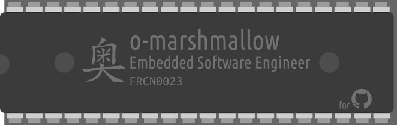

<h1 align="center">
  
</h1>

## 👋 Hello, world!

Welcome to my Github profile!

My name is Omar, I am an embedded software programmer currently working at .
Passionate by computer science since my young age, I have never stopped learning more and more about anything related from far and near to computers. Sharing knowledge is the best way to become better programmers and better engineers together!

Interested by newest technologies, I am even more fascinated and found of retrocomputing: learning more how it started gives a lot of answers about how computers have reached the current state.

<h2>
   Programming langages
</h2>

  

   

        

 

  

<h2>
   Tools
</h2>

  

    

 

 

